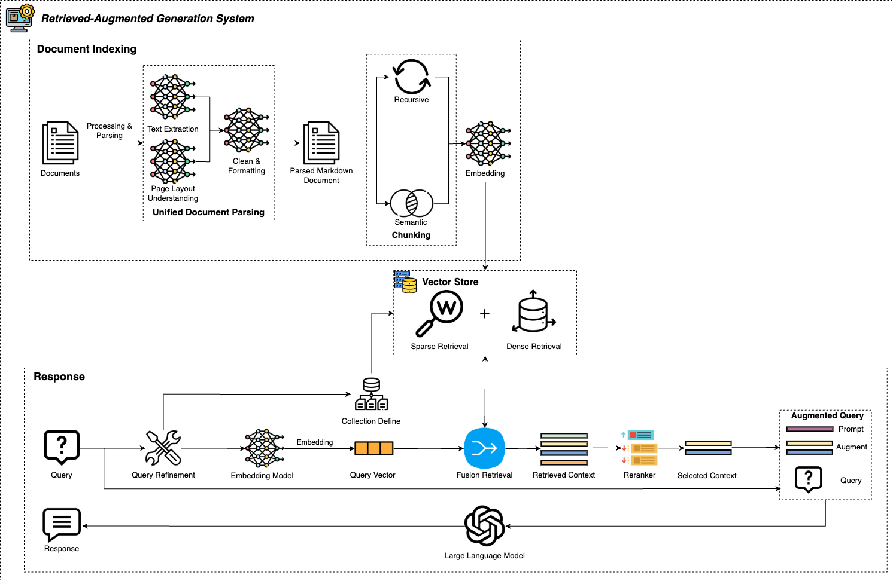

# Retrieved-Augmented Generation (RAG) Backbone

## Table of Contents

- [Overview](#Overview)
- [Prerequisites](#prerequisites)
- [Installation](#installation)
- [Usage](#usage)

## Overview 
A backbone that utilize LLM and vector database for various downstream application, 
including but not limited to document question-answering and document search.



The RAG system consist of two main pipelines: `Document Indexing` & `General Response`.

In `Document Indexing` stage, we first parse the documents (in `.pdf` format) into plain
text, followed by different chunking method including `recursive` and `semantic`
chunking. The created chunks will be stored in the vector database. In the 
`General Response`, relevant information or document will be retrieved from 
vector database by defining the collections relevant to the user query. 

The RAG system support dense retrieval and sparse retrieval, user query refinement 
and also enable retrieving from multiple collections. 
<br />
## Prerequisites
Before installing and using the RAG Backbone, ensure that the following components are set up and running:

### 1. Langfuse Server
Langfuse is used for monitoring and logging within the RAG system. Follow these steps to set it up:
```bash
git clone https://github.com/langfuse/langfuse.git
cd langfuse
docker compose up -d
```

### 2. Document Parser
The document parser processes documents for ingestion into the RAG system and is hosted in a separate repository. Follow these steps to set it up:
```bash
git clone https://github.com/paultsoi1014/Document-Parser.git
cd Document-Parser
docker compose up -d --build
```

## Installation
### 1. Clone the repository:
```bash
git clone https://github.com/paultsoi1014/RAG-Backbone.git
```
### 2. Navigate to the project directory:
```bash
cd rag_backbone
```
### 3. Create and activate a virtual environment:
#### Option 1: Using `venv` (Python Standard Library)
```bash
python -m venv venv
source venv/bin/activate
```
#### Option 2: Using `conda` (Python 3.11)
```bash
conda create --name myenv python=3.11
conda activate myenv
```

### 4. Install dependencies:
```bash
pip install -r requirements.txt
```

## Usage
### 1. Set Up Environment Variables
Copy the example environment file and configure your own `.env`:
```bash
cp .env.example .env
```
Edit the `.env` file to update necessary configurations.

### 2. Set Up Qdrant Vector Database
Run the setup script to configure the Qdrant database:
```bash
sh setup.sh
```

### 3. Run Document Ingestion
```python
rag_agnet = RAGAgent()

# Define the folder path, collection name, and chunking mode
folder_path = "path/to/your/documents"  # Replace with the actual folder path
collection_name = "your_collection_name"  # Replace with the desired collection name
mode = "recursive"  # Choose between "recursive" or "semantic" chunking

# Ingest files from the specified folder into the RAG system
rag_agnet.file_ingestion(
    folder_path=folder_path,
    collection_name=collection_name,
    mode=mode,
)
```

### 4. Run Question-Answering Based On Ingested Documents
```python
rag_agnet = RAGAgent()

# Define your query and the collections to retrieve from
query = "Your input query here"
collections = ["collection_1", "collection_2"]  # List of collections to search in

# Generate a response using the RAGAgent
response = rag_agnet.generate_response(
    query=query,
    collections=collection,
    query_rewrite=True, # Enable automatic query rewriting
    chat_mode=False, # Set to True for conversational mode, False for structure output
)

# Print or process the response
print(response)
```


